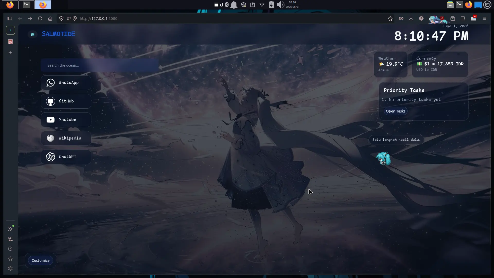
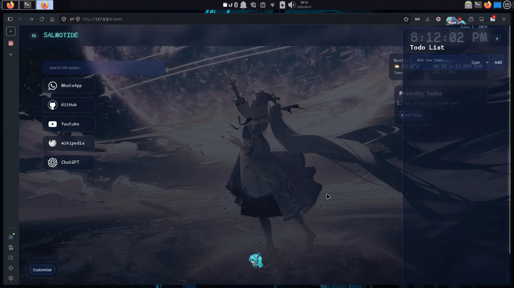
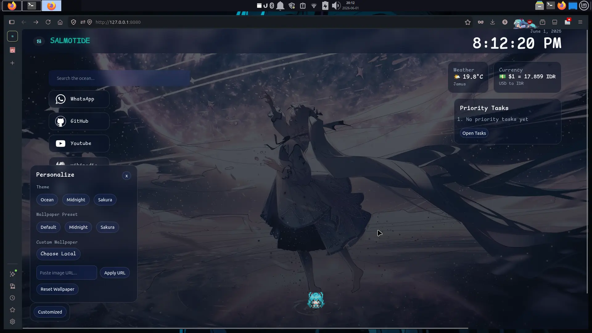
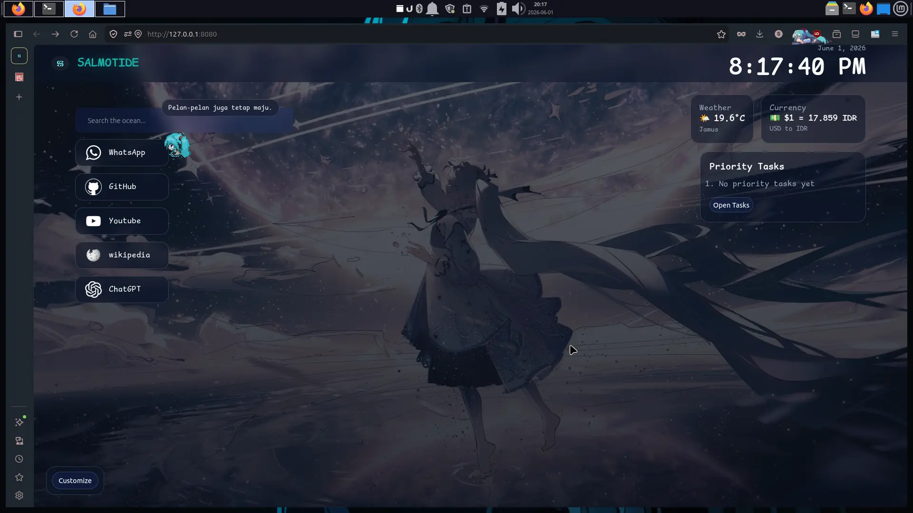

# Ocean Startpage


A customizable browser startpage inspired by ocean themes, desktop pets, and productivity tools.



**🌐 Live Demo:** https://salmotide.github.io/ocean-startpage/

---

# Installation

Clone repository:

```bash
git clone https://github.com/salmotide/ocean-startpage.git

## Overview

Ocean Startpage is a personal browser homepage designed to make your daily browsing experience more enjoyable and productive.

Instead of opening a blank browser tab, Ocean Startpage provides:

* Search bar
* Quick shortcuts
* Todo list
* Weather widget
* Currency widget
* Live clock
* Theme customization
* Wallpaper customization
* Interactive pixel character companion

The project is built using only:

* HTML
* CSS
* JavaScript

No frameworks are required.

---

# Features

## Search Bar

Quickly search using Google directly from the homepage.

### Features

* Instant search
* Autofocus when page opens
* Keyboard friendly

---

## Quick Shortcuts

Access frequently used websites quickly.

### Default Shortcuts

* WhatsApp
* GitHub
* YouTube
* Wikipedia
* ChatGPT

### Easily Customizable

You can edit the links inside the HTML file.

---

## Weather Widget

Displays current weather information.

### Information

* Temperature
* Weather icon
* Weather status

---

## Currency Widget

Displays exchange rate information.

### Information

* USD to IDR

---

## Live Clock

Displays:

* Current time
* Current date

Updates automatically in real-time.

---

## Todo List

A built-in task management system.

### Features

* Add tasks
* Remove tasks
* Priority tasks
* Task colors
* Auto save using Local Storage

### Priority System

Important tasks can be pinned.

Pinned tasks appear inside:

**Priority Tasks Panel**

for quick viewing.

---

## Theme System

Switch the appearance of the startpage instantly.

### Available Themes

#### Ocean

Default blue ocean theme.

#### Midnight

Dark purple and dreamy night theme.

#### Sakura

Soft pink and pastel theme.

### Features

* One click switch
* Automatically saved
* Loaded on startup

---

## Wallpaper System

Customize the background image.

### Preset Wallpapers

* Ocean
* Midnight
* Sakura

### Custom Wallpapers

Upload your own image.

### Features

* Auto compression
* Auto save
* Restore after browser restart

---

## Personalize Panel

Central place for customization.

### Includes

* Theme selection
* Wallpaper presets
* Custom wallpaper upload
* Character settings

---

# Pixel Character Companion

A desktop-pet style character that lives on the startpage.

The character is fully interactive.

---

## Character Movement

Move the character using custom controls.

### Default Keys

| Action | Key |
| ------ | --- |
| Up     | W   |
| Down   | S   |
| Left   | A   |
| Right  | D   |
| Action | E   |

---

## Custom Keybind System

All movement keys can be changed.

### Features

* Custom movement keys
* Custom interaction key
* Auto save
* Persistent settings

---

## Character States

The character uses a simple state system.

### NPC Mode

Default behavior.

The character:

* Stays idle
* Walks randomly
* Displays motivational messages

---

### Player Mode

Activated when movement keys are pressed.

The player controls the character directly.

---

### Follow Mode

Activated by clicking the character.

The character follows the mouse cursor.

Click again to disable.

---

## Interaction System

The character can interact with UI elements.

### Action Key

Default:

E

### Interactable Elements

* Buttons
* Links
* Inputs
* Textareas
* Select boxes

### Examples

Open Todo Panel:

1. Move near the button
2. Press E
3. The button is activated

---

## Interaction Hint

When standing near an interactable element:

A small floating key indicator appears.

Example:

E

Showing the currently configured action key.

---

## Character Bubble Messages

The character occasionally displays messages.

### Examples

* Semangat, salmotide.
* Satu langkah kecil dulu.
* Aku masih di sini.
* Jangan menyerah sekarang.

Messages appear automatically while idle.

---

## Auto NPC Behavior

When inactive:

1. Character becomes NPC
2. Waits a few seconds
3. Walks to a random location
4. Returns to idle

This makes the character feel alive.

---

# Local Storage

The project automatically saves:

* Theme
* Wallpaper
* Todo List
* Priority Tasks
* Character Keybinds

Settings remain after refreshing or reopening the browser.

---

# Project Structure

```text

Ocean-Startpage/
├── assets/
│   ├── css/
│   └── js/
│
├── image/
│   ├── hatsu/
│   ├── screenshots/
│   ├── bg.webp
│   ├── midnight.webp
│   ├── sakura.webp
│   └── logo.webp
│
├── index.html
└── README.md

```

---

# Screenshots

## Main Page


---

## Todo List



---

## Personalize Panel



---

## Character Companion



---

# Future Plans

Planned features:

* Character moods
* Character animations
* Multiple characters
* Character inventory
* Achievement system
* Music player
* Notes widget
* Calendar widget
* More themes
* More wallpapers

---

# License

This project is open source.

Feel free to modify and personalize it for your own use.
